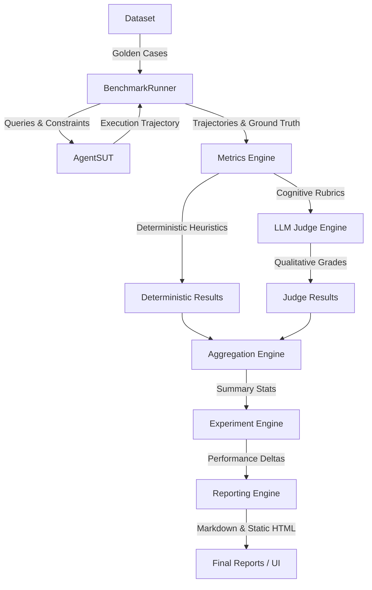

# EvalForge — Production-Grade AI Agent Evaluation Engine

EvalForge is a model-agnostic, production-grade AI Agent Evaluation Framework designed to benchmark, audit, and observe AI agents running in complex, multi-turn, constraint-bound environments. 

---

## Overview

As AI agents transition from simple chat assistants to autonomous task-solving systems (e.g., travel assistants booking flights, hotel accommodations, or interacting with weather and lookup APIs), verifying their correctness, safety, and performance becomes a critical bottleneck. 

EvalForge provides a pluggable evaluation ecosystem. It coordinates benchmark execution across versioned golden datasets, traces agent execution paths (trajectories), applies deterministic performance/retrieval metrics alongside LLM-as-a-judge qualitative checks, and persists outcomes in a relational database for visualization and delta regression analysis.

---

## Problem Statement

### 1. What problem does EvalForge solve?
Building AI agents is easy, but making them reliable in production is hard. Unlike traditional software, AI agents are non-deterministic, interact with third-party tools dynamically, and can fall into infinite execution loops, leak system instructions, or fail safety policies. EvalForge provides a testing framework to validate agent code changes, prompts, and models before deploying them to customers.

### 2. Why is AI evaluation difficult?
Evaluating multi-turn agents is complex because:
- **Statefulness**: The agent's next action depends on prior tool outputs.
- **Tool Dependency**: The agent must select the correct tools and format arguments correctly.
- **API Flakiness**: Third-party API errors or rate limits (429s) can cause transient agent failures.
- **Cost & Latency**: Running evaluations across thousands of test cases is expensive and slow.

### 3. Why are deterministic metrics alone insufficient?
Deterministic metrics (e.g., checking if the agent output matches an exact string, checking execution times, or validating tool syntax) are useful but fail to grade **reasoning capability**. For instance:
- An agent might fetch the correct flight details but explain them to the user in a confusing or inaccurate way (Faithfulness / Groundedness).
- An agent might solve the task but hallucinate extra information not present in the database.
- Checking text similarity (like BLEU or ROUGE) correlates poorly with human judgment.
Qualitative evaluations require **cognitive LLM-as-a-judge** grading, which operates on semantic rubrics rather than token matches.

---

## Solution

EvalForge addresses these challenges by uniting deterministic, retrieval, and cognitive metrics in a structured evaluation pipeline:
1. **Decoupled Architecture**: Segregates the core evaluation engine from both the System Under Test (SUT) and the LLM API provider.
2. **Standardized Benchmarking**: Runs evaluations concurrently via bounded async task execution with fault shielding and exponential backoff retries.
3. **Structured Judgements**: Leverages Pydantic validation on LLM judge outputs to handle parsing anomalies and stabilize qualitative grades.
4. **Experimental Progression**: Groups evaluation runs into experiments and calculates deltas (performance and accuracy shifts) between the baseline run and current iterations.

---

## Key Features

- **Domain Agnostic Core**: The core orchestrator and evaluators contain zero business logic of the target agent application.
- **Robust SUT Interface**: Integrates via a clean `AgentSUT` interface that supports multi-turn execution step traces.
- **Comprehensive Metric Suites**:
  - **Deterministic (Heuristics)**: Execution step budgets, token consumption, cost validation, and tool-call loop checkers.
  - **Retrieval**: Context Precision and Context Recall against ground truth database lookups.
  - **Cognitive (LLM-as-a-Judge)**: Built-in qualitative assessments for `Faithfulness`, `Groundedness`, `AnswerCorrectness`, and `Hallucination`.
- **Structured LLM Judges**: Robust parser that extracts JSON blocks from raw text, validates them against Pydantic schemas, and retries on failure.
- **Dataset Versioning**: Strictly enforces SemVer versioning on Golden Datasets to prevent evaluation drift.
- **Experiment Delta Tracking**: Automates comparison of runs, identifying regressions in success rates, cost, latency, and token consumption.
- **Observability**: Exposes structured JSON lines logging for indexing, and prints high-fidelity console tables via `rich`.
- **Dual-Service Web Workspace**: A fast backend API (FastAPI) combined with a sleek React UI workspace (Next.js) for starting benchmarks and inspecting trace trajectories.

---

## Why This Tech Stack?

We selected this stack to balance local developer productivity with production-grade portability:

| Technology | Rationale | Alternatives Considered | Trade-offs |
| :--- | :--- | :--- | :--- |
| **FastAPI** | Extremely fast, supports native async event loops, auto-generates Swagger docs, and handles worker threads via `BackgroundTasks`. | Express/Node.js, Flask | Python has slower raw loop execution than Node, but FastAPI's async support minimizes I/O bottlenecks. |
| **Next.js** | React component model, server-side layouts, and standard deployment patterns for developer dashboards. | Static HTML, Vue/Nuxt | Next.js adds node dependencies and build times, but is necessary for interactive trace inspectors and comparison grids. |
| **TypeScript** | Static typing on the frontend prevents UI runtime failures, especially when handling complex evaluation run JSON payloads. | Vanilla JavaScript | Adds build transpilation step, but vastly improves developer experience and maintenance. |
| **SQLite** | Zero-configuration, serverless, single-file storage. Essential for fast local developer setup. | PostgreSQL | PostgreSQL requires running a database service locally. SQLite is single-user only, but is wrapped in a repository pattern for clean migration later. |
| **Docker** | Multi-container isolation guarantees that environment configurations (python, node, databases) are identical locally, in CI, and in cloud staging. | Bare-metal scripts | Increases initial setup build time, but avoids "it works on my machine" issues. |
| **Pydantic** | Validates configuration inputs, JSON API schemas, and guarantees structured JSON shapes from LLMs via native compiled Rust speed. | Standard JSON dicts, Marshmallow | Adds a small dependency footprint, but provides type safety and structural validation. |
| **Recharts** | Declarative React charts designed for rendering dashboards and rendering metric trends dynamically. | Chart.js, D3.js | D3 is more powerful but has a steep learning curve. Recharts provides modern look-and-feel out of the box. |
| **AsyncIO** | Python's native async runtime allows concurrent execution of hundreds of LLM calls without spawning expensive OS threads. | Threading, Multiprocessing | Debugging async race conditions can be tricky, but it offers the highest performance for I/O-bound LLM applications. |

---

## Internal Workflow

The diagram below details the end-to-end flow of an evaluation sweep inside EvalForge:



### Step-by-Step Execution:
1. **Dataset Loading**: The `DatasetLoader` loads versioned golden test cases and validates schemas.
2. **Benchmark Execution**: `BenchmarkRunner` triggers cases concurrently up to a defined semaphore boundary.
3. **Agent Interaction**: The runner passes the input query to the `AgentSUT`, tracking each step and tool execution into a `Trajectory`.
4. **Metrics Calculation**: The `MetricsEngine` processes the trajectory against:
   - **Deterministic evaluators** (Token count, latency, tools validation).
   - **Retrieval evaluators** (Precision and recall of context records).
5. **LLM Judging**: Qualitative parameters are sent to `LLMJudgeEngine` where LLM-as-a-judge nodes evaluate reasoning against templates.
6. **Aggregation**: Results of all test cases are compiled into an `EvaluationRun` containing mean statistics.
7. **Experiment Sweep**: The `ExperimentEngine` correlates runs, computing performance regressions or improvements compared to baseline records.
8. **Reporting**: The engine exports detailed markdown reports and saves transaction records to SQLite.

---

## Project Structure

```
├── .github/
│   └── workflows/
│       └── ci.yml              # CI automation (linting, types, tests)
├── docs/
│   ├── adr/                    # Architecture Decision Records (ADR-0001 to ADR-0006)
│   └── architecture.md         # Detailed architectural design blueprints
├── examples/
│   └── travel_agent/           # Reference SUT implementation and database simulation
│       ├── services.py         # Mock travel databases and search operations
│       └── travel_agent_sut.py # Concrete SUT that implements AgentSUT interface
├── frontend/                   # Next.js TypeScript Web Application
│   ├── Dockerfile              # Docker build file for frontend app
│   ├── package.json            # Node project configuration and package dependencies
│   ├── tsconfig.json           # TypeScript configuration
│   └── src/app/
│       ├── layout.tsx          # Root web document and font injection
│       └── page.tsx            # Main platform UI dashboard and trace inspector
├── src/                        # Core Python Platform Code
│   ├── domain/                 # Domain Layer: Pure models and interface definitions
│   │   ├── entities/           # EvaluationRun, Trajectory, Step, GoldenTestCase
│   │   ├── value_objects/      # Cost, Latency, TokenUsage (immutables)
│   │   └── interfaces/         # Contracts (AgentSUT, LLMProvider, Repository)
│   ├── use_cases/              # Use Cases Layer: Orchestrators and rules
│   │   ├── runners/            # BenchmarkRunner orchestrator
│   │   ├── metrics/            # Deterministic, Retrieval, and Registry systems
│   │   ├── judges/             # Qualitative LLM Judges and Prompt Templates
│   │   └── experiments/        # Regression delta calculator and report builder
│   ├── adapters/               # Adapters Layer: Implementation of interfaces
│   │   ├── llm/                # Gemini, Ollama, OpenRouter providers
│   │   ├── repositories/       # Thread-safe SQLite repository
│   │   └── api/                # FastAPI application endpoints
│   └── infrastructure/         # Infrastructure Layer: Logging formats and config loading
│       └── logging/            # Structured JSON formatter
├── tests/                      # Verification Suite
│   ├── unit/                   # Fast isolated unit tests with mock SUTs
│   └── integration/            # E2E pipeline and API transaction tests
├── Dockerfile                  # Docker build file for FastAPI backend app
├── docker-compose.yml          # Docker Compose orchestration
├── requirements.txt            # Python dependencies
└── pyproject.toml              # Python tool definitions (pytest, black, ruff, mypy)
```

---

## Design Decisions

All engineering decisions are documented sequentially via ADRs:
- **[ADR-0001](file:///d:/AI/evalforge/docs/adr/0001-record-architecture-decisions.md)**: Standardizes Architecture Decision Record logging.
- **[ADR-0002](file:///d:/AI/evalforge/docs/adr/0002-tech-stack-and-architecture-patterns.md)**: Approves Python 3.11+, Pydantic v2, and clean architecture boundaries.
- **[ADR-0003](file:///d:/AI/evalforge/docs/adr/0003-pluggable-llm-provider-and-metrics-specification.md)**: Decouples metric evaluators and LLM client providers.
- **[ADR-0004](file:///d:/AI/evalforge/docs/adr/0004-sqlite-repository-and-travel-agent-sut-design.md)**: Specifies the SQLite repository schema and thread-safe operations.
- **[ADR-0005](file:///d:/AI/evalforge/docs/adr/0005-metrics-engine-registry-and-aggregation-design.md)**: Details the Registry pattern for plugins and separation of stats aggregation.
- **[ADR-0006](file:///d:/AI/evalforge/docs/adr/0006-platform-and-rest-api-specification.md)**: Formulates FastAPI REST endpoints, background threads, and structured JSON logs.

---

## Challenges Faced

During development, several complex engineering challenges were addressed:

### 1. Framework vs SUT Separation
A common framework anti-pattern is importing target agent logic directly into the testing harness. To keep EvalForge domain-independent, we created the `AgentSUT` interface. The core framework (`src/`) has **zero imports** referencing the Travel Agent application (`examples/`). The travel assistant is injected purely at runtime.

### 2. Registry Pattern Adoption
To prevent the orchestrator from growing into a monolithic block of imports, we adopted the Registry Pattern. The `MetricRegistry` and `JudgeRegistry` manage discovery and registration of evaluators. This design permits adding new metrics without touching the `BenchmarkRunner` code.

### 3. Provider Abstraction
To support Gemini (cloud), Ollama (local offline), and OpenRouter, we implemented the `LLMProvider` interface. Use Cases interact purely with the abstract contract, making the evaluation pipeline completely agnostic to the underlying API.

### 4. LLM Rate Limits & Retry Handling
Running high-concurrency evaluation tasks easily triggers HTTP 429 rate limit exceptions. We resolved this by building a dedicated backoff handler using exponential retry delays in both our LLM providers and the qualitative judges.

### 5. Structured Judge Outputs
Qualitative judges must return scores and confidence levels. However, LLMs frequently return invalid JSON or extra conversational text. We solved this by wrapping LLM judge queries in a robust structured parser: it extracts standard markdown JSON blocks, parses them using a Pydantic schema, and retries the request if validation fails.

### 6. Docker Configuration & Networking
Creating a unified Docker Compose setup required configuring Next.js environment variables to target the correct FastAPI backend container depending on whether requests are resolved server-side or client-side. We established proper internal service networking and CORS parameters to facilitate seamless container integration.

### 7. Asynchronous Tasking
Because evaluation sweeps take minutes to execute, blocking HTTP connections would result in network timeouts. We resolved this by using FastAPI's `BackgroundTasks` to start runs asynchronously, return a `run_id` instantly, and allow the frontend to poll for state changes and render traces.

---

## Future Improvements

To prepare EvalForge for enterprise cloud environments, we recommend:
- **PostgreSQL Database Support**: Replace the single-user SQLite adapter with a PostgreSQL repository for multi-user, transactional persistence.
- **Distributed Run Queues**: Integrate Celery or Redis Task Queues to distribute evaluation tasks across multiple worker nodes.
- **Authentication & RBAC**: Implement OAuth2, JWT tokens, and role-based permissions (Viewer, Operator, Admin) to protect endpoints.
- **Real-Time Monitoring**: Implement WebSockets or Server-Sent Events (SSE) to stream live trajectories, avoiding client polling.
- **Expanded Evaluators**: Implement specialized checks for prompt injection, bias audit, PII data leakage, and toxic content detection.
- **Plugin Marketplace**: Create a package loader so custom metrics can be distributed and imported as python modules.
- **Cloud Deployment**: Provide Terraform templates for deploying the platform to AWS (ECS Fargate/Aurora) or GCP.

---

## Quick Start

### 1. Local Development Setup

#### Backend API Setup
1. Standardize on Python 3.11+.
2. Create and activate a virtual environment:
   ```bash
   python -m venv .venv
   # Windows:
   .venv\Scripts\activate
   # macOS/Linux:
   source .venv/bin/activate
   ```
3. Install the dependencies:
   ```bash
   pip install -r requirements.txt
   ```
4. Configure environment variables in a `.env` file at the root:
   ```env
   GEMINI_API_KEY=your_gemini_api_key
   OLLAMA_API_BASE=http://localhost:11434
   OPENROUTER_API_KEY=your_openrouter_api_key
   ```
5. Run the FastAPI server:
   ```bash
   python -m uvicorn src.adapters.api.app:app --host 0.0.0.0 --port 8000 --reload
   ```
   - **Swagger Docs**: http://localhost:8000/docs
   - **Health API**: http://localhost:8000/health

#### Frontend Next.js Setup
1. Navigate to the `frontend` directory:
   ```bash
   cd frontend
   ```
2. Install npm packages:
   ```bash
   npm install
   ```
3. Run the development server:
   ```bash
   npm run dev
   ```
4. Access the web dashboard at http://localhost:3000.

---

### 2. Multi-Container Docker Build

You can start the backend API and Next.js UI using Docker Compose. Ensure Docker is running locally:
```bash
# Build and run containers in background
docker-compose up --build
```
- **Backend API**: http://localhost:8000
- **Frontend Dashboard**: http://localhost:3000

---

## Testing

Ensure code style and types are correct by running the testing scripts:

### 1. Code Style Formatting (Black)
Ensure formatting matches standards:
```bash
python -m black --check src tests
```

### 2. Code Linting (Ruff)
Execute the linter to verify code patterns:
```bash
python -m ruff check src tests
```

### 3. Static Type Verification (Mypy)
Check type correctness:
```bash
python -m mypy src tests
```

### 4. Test Suites (Pytest)
Run all 68 unit and integration tests:
```bash
python -m pytest
```

---

## Screenshots

> [!NOTE]
> Below are placeholders for the EvalForge Dashboard interface:
> 
> 
> *Placeholder: Overview tab showing total runs, success rates, cumulative costs, and the Async Run Launch Panel.*
> 
> 
> *Placeholder: Run History tab rendering step-by-step agent traces and LLM-as-a-judge score cards.*

---

## License

This project is licensed under the MIT License. See [LICENSE](LICENSE) for details.
